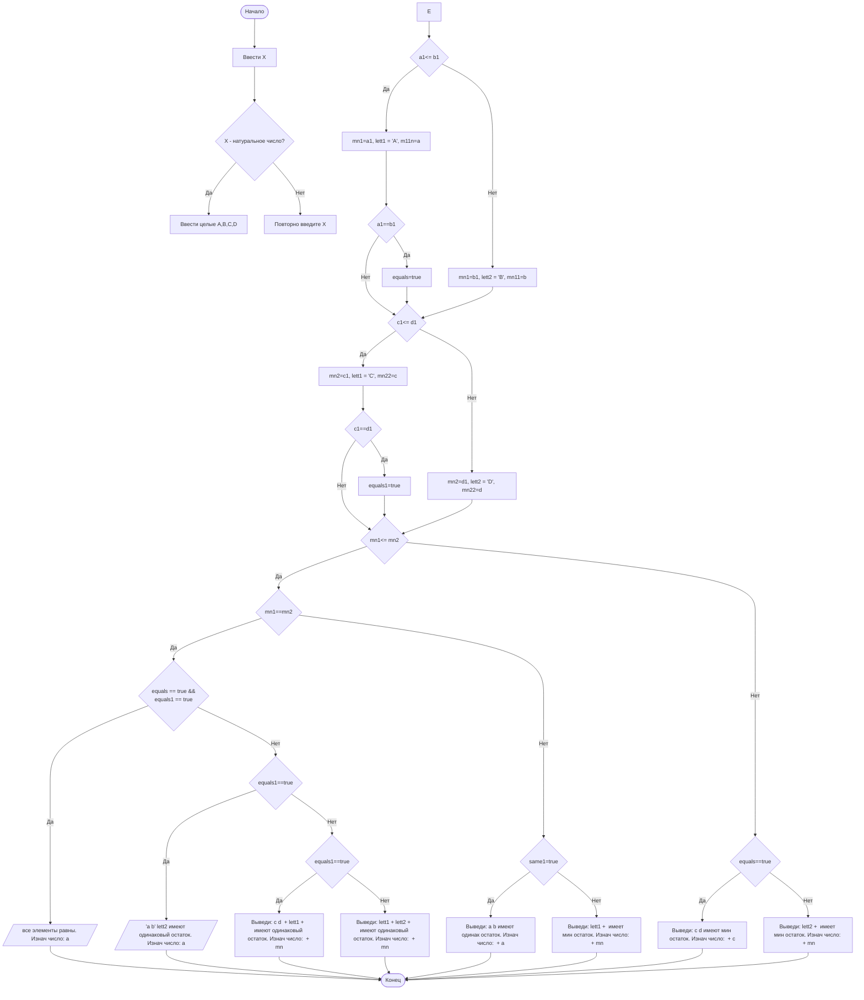

## Отчет по лабораторной работе № 1

#### № группы: `ПМ-2502`

#### Выполнил: `Рахматуллин Вадим Тимурович`

#### Вариант: `17`

### Cодержание:

- [Постановка задачи](#1-постановка-задачи)
- [Входные и выходные данные](#2-входные-и-выходные-данные)
- [Выбор структуры данных](#3-выбор-структуры-данных)
- [Алгоритм](#4-алгоритм)
- [Программа](#5-программа)
- [Анализ правильности решения](#6-анализ-правильности-решения)

### 1. Постановка задачи

> На вход программе подаются четыре целых числа A, B, C, D. Необходимо определить число, имеющее минимальный остаток от деления на X.

- Нужно создать алгоритм, определяющий элемент с минимальным остатком от деления на натуральное число X среди введенных четырех целых чисел.
- Сначала вычислим остаток от деления на X, и присвоим эти значениния определенным переменным.
- Объявим необходимые переменные. 
- Сравним попарно остатки чисел от деления на Х. 
- Сравним пару получившихся мнимальных остатков от кадждой пары чисел(a,b и c,d)
- проверим случаи совпадения остатков

### 2. Входные и выходные данные

**Данные на вход**

По условии на вход нам падается четыре целых числа A,B,C,D и одно натуральное X, что вводится в рамках целочисленного типа данных.

|    Число    | Тип                | min значение    | max значение   |
|-------------|--------------------|-----------------|----------------|
|     x       |  Натуральное число |        1        |        +∞      |
|     a       |    Целое число     |       -∞        |        +∞      |
|     b       |    Целое число     |       -∞        |        +∞      |
|     c       |    Целое число     |       -∞        |        +∞      |
|     d       |    Целое число     |       -∞        |        +∞      |


**Данные на выход**

На выходе мы будем получать не только числа, ограниченные диапозонами типов переменных, но и слова.

|             | Тип                | min значение    | max значение   |
|-------------|--------------------|-----------------|----------------|
|     a       |      Целое число   |   -2147483647   |    2147483647  |
|     b       |      Целое число   |   -2147483647   |    2147483647  |
|     c       |      Целое число   |   -2147483647   |    2147483647  |
|     d       |      Целое число   |   -2147483647   |    2147483647  |
|     lett1   |        String      |   -2147483647   |    2147483647  |
|     lett2   |        String      |   -2147483647   |    2147483647  |

### 3. Выбор структуры данных

Программа на вход получает 5 натуральных чисел, тогда нужно создать 5 переменных (`x, a, b, c, d`)
типа `int`.

|Число|Название переменной|Тип переменной|
|-----|-------------------|--------------|
|  X  |         x         |     int      |
|  A  |         a         |     int      |
|  B  |         b         |     int      |
|  C  |         c         |     int      |
|  D  |         d         |     int      |

Результатом программы будут являться 2 - 3 переменные: строчные ('lett1, lett2'), а также целочисленные 'mn'

|Число|Название переменной|Тип переменной|
|-----|-------------------|--------------|
|  B  |         b         |     int      |
|  A  |         a         |     int      |
|  C  |         c         |     int      |
|  D  |         d         |     int      |
|  -  |       lett1       |     String   |
|  -  |       lett2       |     String   |

### 4. Алгоритм
**Алгоритм работы программы**
1. Получаем и считываем четыре целых числа **A, B, C, D.**
2. Получаем и считываем переменную **X**. 
3. Создаем переменные **a1, b1, c1, d1**, присваиваем им остаток от деления **A, B, C, D** на **X**.
4. Объявляем переменные: **mn1**,  **mn2**, **mn11**, **mn22** ,**lett1** и **lett2**, а также логические переменные **equals** и **equals1**, которые будут определять равенство элементов пары.
5. Сначала проверим условие  **a1<=b1**. Если оно является истинным, то **mn1** = **a1**, **mn11** = **a**, **lett1** = **'a'**. Также будет рассмотрено условие **a1==b1**. В случае его истинности, **equals** = **true**.
Если первое условие - ложное, то **mn1** = **b1**, **mn22** = **b** , **lett1** = **'b'**.
6. Аналогично программа рассматривает **c1<=d1**, но уже с переменными **mn2**, **mn22**, **equals1** и **lett2**.
7. Теперь программа перейдет к рассмотрению  **mn1<=mn2**.
- Если **mn1==mn2**, тол нужно определить, какое количество элементов совпадает. Это проверяется по значениям переменных **equals** и **equals1**. Если истины оба - выводим сообщением об одинаковом остатке, если верно только **equals** - выводим оба элемента первой пары и нужный элемент второй, если верно только **equals1** - выводим оба элемента второй пары и нужный элемент первой.
- В случае ложного значения **mn1==mn2** программа проверяет значение **equals**, и выводит либо **lett1**, либо оба элемента первой пары.
- Если **mn1<=mn2** было ложно, то программа аналогично проверяет значение **equals**, и в зависимости от этого выводит либо **lett2**, либо оба элемента второй пары.

**Блок-схема**


### 5. Программа

```java
import java.util.Scanner;
import java.io.PrintStream;
public class Main {
    // вводим PrintStream для удобного вывода данных
    public static PrintStream out = System.out;
    // вводим Scanner для удобного ввода данных
    public static Scanner in = new Scanner(System.in);

    public static void main(String[] args) {
        // считываем данные 4-х целых чисел и 1 натурального
        out.println("введите 4 целых числа");
        int a = in.nextInt();
        int b = in.nextInt();
        int c = in.nextInt();
        int d = in.nextInt();
        out.println("введите делитель");
        int x = in.nextInt();
        // считаем остаток от деления на х
        int a1 = a % x;
        int b1 = b % x;
        int c1 = c % x;
        int d1 = d % x;
        // вводим переменные для мин остатка и буквы, а также "флаги равности"
        int mn1;
        int mn2;
        int mn11;
        int mn22;
        int mn;
        String lett1;
        String lett2;
        boolean equals = false;
        boolean equals1 = false;

        if (a1 <= b1) { // сравниваем остатки а1 b1
            mn1 = a1; 
            mn11 = a;
            lett1 = "a";
            if (a1 == b1) { // проверяем равенство остатков а1 b1
                equals = true; // сменяем первый "флаг равности" на true
            }
        } else {
            mn1 = b1;
            mn11 = b;
            lett1 = "b";
        }
        if (c1 <= d1) { // сравниваем остатки c1 d1
            mn2 = c1;
            lett2 = "c";
            mn22 = c;
            if (c1 == d1) { // проверяем равенство остатков c1 d1
                equals1 = true; // сменяем второй "флаг равности" на true
            }
        } else {
            mn2 = d1;
            mn22 = d;
            lett2 = "d";
        }
        if (mn11 <= mn22) { // сравниваем числа с минимальными остатками каждой пары
            mn = mn11;
        } else {
            mn = mn22;
        }

        if (mn1 <= mn2) { // сравниваем остатки каждой пары
            if (mn1 == mn2) { // проверяем на совпадение 
                if (equals == equals1) { // проверяем "флаги равности" на совпадение
                    out.println("все элементы равны. Изнач число:  " +  a);
                } else {
                    if (equals) {
                        out.println("a b " + lett2 + " имеют одинаковый остаток. Изнач число: " + a);
                    } else {
                        if (equals1) {
                            out.println("c d " + lett1 + " имеют одинаковый остаток. Изнач число: " + mn);
                        } else {
                            out.println(lett1 + lett2 + " имеют одинаковый остаток. Изнач число: " + mn);
                        }
                    }
                }
            } else {
                if (equals) { // если выполняется первый "флаг равности"
                    out.println("a b имеют одинак остаток. Изнач число: " + a);
                }
                else {
                    out.println(lett1 + " имеет мин остаток. Изнач число: " + mn);
                }
            }
        }
        else {
            if (equals1) { // если выполняется второй "флаг равности"
                out.println("c d имеют мин остаток. Изнач число: " + c);
            } else {
                out.println(lett2 + " имеет мин остаток. Изнач число: " + mn);
            }
        }
    }
}
```

### 6. Анализ правильности решения

1. Все элементы равны.
  - **Input**:
      ```
      50
      50
      50
      50
      5
      ```
  - **Output**:
      ```
      все элементы равны. Изнач число:  50
      ```
      
2. Только 1 мин. элемент.
  - **Input**:
        ```
        50
        51
        52
        53
        5
        ```
    - **Output**:
        ```
        a имеет мин остаток. Изнач число: 50
        ```
        
3. Равны элементы первой пары и один из второй.
    - **Input**:
        ```
        50
        50
        50
        51
        5
        ```
    - **Output**:
        ```
        a b c имеют одинаковый остаток. Изнач число: 50
        ```
        
4. Равны элементы во второй паре и один из первой.
    - **Input**:
        ```
        51
        50
        50
        50
        5
        ```
    - **Output**:
        ```
        c d b имеют одинаковый остаток. Изнач число: 50
        ```

5. Элементы 2-х пар равны и минимальны.
    - **Input**:
        ```
        50
        50
        51
        51
        5
        ```
    - **Output**:
        ```
        a b имеют одинак остаток. Изнач число: 50
        ```


